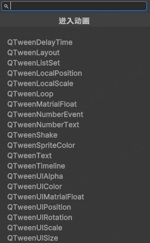

# 可搜索下拉框
基于AdvancedDropdown制作的可搜索下拉框


```csharp
public class QAdvancedDropdown : AdvancedDropdown {
	public AdvancedDropdownItem Root { get; private set; }
	public QDictionary<string,AdvancedDropdownItem> Items { get; private set; }
	public QDictionary<AdvancedDropdownItem, Action> Actions { get; private set; } = new();
	public QAdvancedDropdown(string title, Action<string> onItemSelected = null) : base(new AdvancedDropdownState()) {
		Root = new AdvancedDropdownItem(title);
		Items = new(key => {
			if (key.SplitTowString("/", out var start, out var end)) {
				var item = new AdvancedDropdownItem(key);
				Items[start].AddChild(item);
				if (onItemSelected != null) {
					Actions[item] = () => onItemSelected(key);
				}
				return item;
			}
			else {
				var item = new AdvancedDropdownItem(key);
				Root.AddChild(item);
				if (onItemSelected != null) {
					Actions[item] = () => onItemSelected(key);
				}
				return item;
			}
		});

	}
	public void Add(string key,Action action=null) {
		var item = Items[key];
		if (action != null) {
			Actions[item] = action;
		}
	}
	public void Add(IList<string> keys) {
		foreach (var key in keys) {
			Add(key);
		}
	}
	protected override AdvancedDropdownItem BuildRoot() {
		return Root;
	}
	protected override void ItemSelected(AdvancedDropdownItem item) {
		base.ItemSelected(item);
		Actions[item]?.Invoke();
	}
}
```

